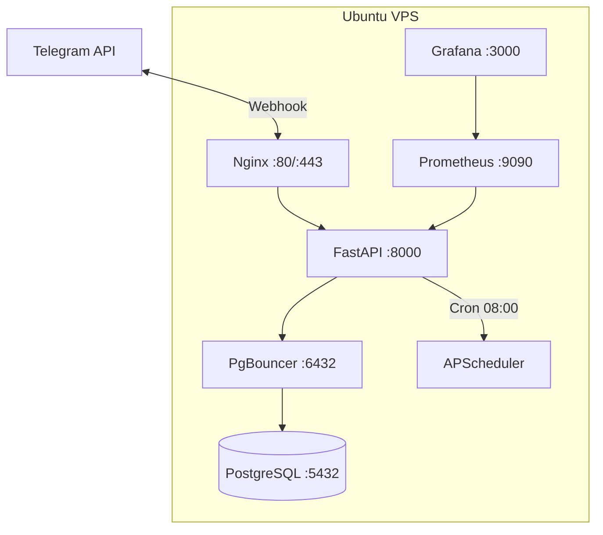
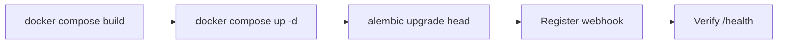

# Sigmo – Deployment Guide

## Overview



---

## Prerequisites

- Ubuntu 22.04+ VPS with a public IP
- Domain name pointed to the server (A record)
- Docker Engine 24+ and Docker Compose v2
- A Telegram bot token from [@BotFather](https://t.me/BotFather)

---

## 1. Server Setup

```bash
# Update system
sudo apt update && sudo apt upgrade -y

# Install Docker
curl -fsSL https://get.docker.com | sh
sudo usermod -aG docker $USER

# Install Docker Compose plugin (if not included)
sudo apt install docker-compose-plugin -y

# Verify
docker compose version
```

## 2. SSL Certificate

```bash
sudo apt install certbot -y
sudo certbot certonly --standalone -d yourdomain.com

# Certificates are stored at:
#   /etc/letsencrypt/live/yourdomain.com/fullchain.pem
#   /etc/letsencrypt/live/yourdomain.com/privkey.pem

# Auto-renew
sudo certbot renew --dry-run
```

## 3. Clone & Configure

```bash
git clone <your-repo-url> /opt/sigmo
cd /opt/sigmo

cp .env.example .env
nano .env
```

Fill in the required values:

```env
TELEGRAM_BOT_TOKEN=<token from BotFather>
POSTGRES_PASSWORD=<strong random password>
```

## 4. Update Nginx Domain

Edit `docker/nginx.conf` and replace `yourdomain.com` with your actual domain on all three occurrences.

## 5. Deploy



```bash
# Build and start all services
docker compose -f docker-compose.prod.yml up -d --build

# Run database migrations
docker compose exec fastapi alembic upgrade head

# Register Telegram webhook
curl -X POST "https://api.telegram.org/bot${TELEGRAM_BOT_TOKEN}/setWebhook" \
     -d "url=https://yourdomain.com/webhook"

# Verify
curl https://yourdomain.com/health
# Expected: {"status":"ok","database":true}
```

## 6. Seed Data

Connect to PostgreSQL and insert your restaurant, staff, and checklist steps:

```bash
docker compose exec postgres psql -U sigmo -d sigmo
```

```sql
-- Add a restaurant
INSERT INTO restaurants (restaurant_id, name, manager_chat_id)
VALUES ('R001', 'My Restaurant', '<manager_telegram_chat_id>');

-- Add staff
INSERT INTO staff (chat_id, name, restaurant_id)
VALUES ('<staff_telegram_chat_id>', 'John', 'R001');

-- Add checklist steps
INSERT INTO checklist_steps (restaurant_id, checklist_id, step_number, instruction, requires_photo) VALUES
('R001', 'KITCHEN_OPEN', 1, 'Turn on all lights', false),
('R001', 'KITCHEN_OPEN', 2, 'Clean prep tables and take a photo', true),
('R001', 'KITCHEN_OPEN', 3, 'Turn on ovens and fryers', false),
('R001', 'KITCHEN_OPEN', 4, 'Check fridge temperatures', false),
('R001', 'KITCHEN_OPEN', 5, 'Set up workstations', false);
```

> **Tip:** To find a user's Telegram `chat_id`, have them message [@userinfobot](https://t.me/userinfobot).

## 7. Operations

### View Logs

```bash
docker compose logs -f fastapi     # App logs
docker compose logs -f postgres    # DB logs
```

### Restart Services

```bash
docker compose -f docker-compose.prod.yml restart
```

### Update Code

```bash
cd /opt/sigmo
git pull
docker compose -f docker-compose.prod.yml up -d --build
docker compose exec fastapi alembic upgrade head
```

### Monitoring

| Service    | URL                             | Purpose         |
| ---------- | ------------------------------- | --------------- |
| Health     | `https://yourdomain.com/health` | App + DB status |
| Prometheus | `http://server-ip:9090`         | Raw metrics     |
| Grafana    | `http://server-ip:3000`         | Dashboards      |

### Key Metrics

| Metric                             | Type      | Description                                |
| ---------------------------------- | --------- | ------------------------------------------ |
| `sigmo_checklist_started_total`    | Counter   | Checklists started by restaurant/checklist |
| `sigmo_checklist_completed_total`  | Counter   | Checklists completed                       |
| `sigmo_checklist_abandoned_total`  | Counter   | Checklists abandoned                       |
| `sigmo_checklist_duration_seconds` | Histogram | Time to complete checklists                |
| `sigmo_webhook_processing_seconds` | Histogram | Webhook processing latency                 |

## 8. Backup

```bash
# Database backup
docker compose exec postgres pg_dump -U sigmo sigmo > backup_$(date +%F).sql

# Restore
cat backup_2026-03-10.sql | docker compose exec -T postgres psql -U sigmo sigmo
```

## 9. Troubleshooting

| Symptom                             | Check                                                                  |
| ----------------------------------- | ---------------------------------------------------------------------- |
| Bot not responding                  | `docker compose logs fastapi` – verify bot token                       |
| `/health` returns `database: false` | `docker compose logs postgres` – check PgBouncer → Postgres connection |
| No daily summary                    | Verify `manager_chat_id` is correct; check scheduler logs              |
| Webhook 504                         | Nginx timeout – check FastAPI is running on port 8000                  |
