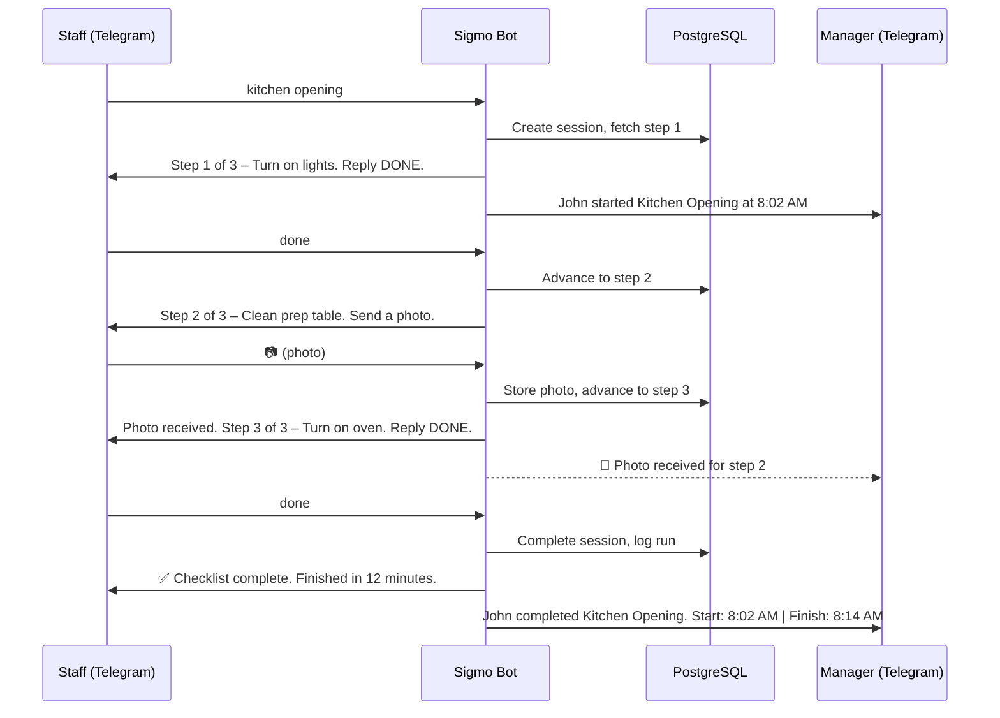
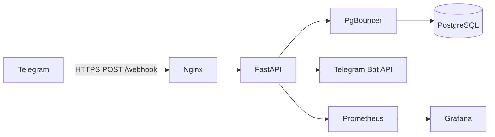

# Sigmo – Telegram Checklist Bot

Sigmo is a Telegram-based operational checklist bot for restaurant staff. It guides employees through predefined step-by-step procedures and gives managers real-time visibility into checklist progress.

## How It Works



## Architecture



## Supported Checklists

| Command           | Checklist ID  |
| ----------------- | ------------- |
| `kitchen opening` | KITCHEN_OPEN  |
| `kitchen closing` | KITCHEN_CLOSE |
| `dining opening`  | DINING_OPEN   |
| `dining closing`  | DINING_CLOSE  |

## Quick Start

```bash
# Clone and configure
cp .env.example .env
# Fill in TELEGRAM_BOT_TOKEN and POSTGRES_PASSWORD

# Run with Docker
docker compose up -d --build

# Apply migrations
docker compose exec fastapi alembic upgrade head

# Register Telegram webhook
curl -X POST "https://api.telegram.org/bot<TOKEN>/setWebhook" \
     -d "url=https://yourdomain.com/webhook"

# Verify
curl https://yourdomain.com/health
```

## Running Tests

```bash
pip install -r requirements.txt
pytest tests/ -v
```

## Project Structure

```
sigmo/
├── app/
│   ├── main.py              # FastAPI app: /webhook, /health, /metrics
│   ├── bot/                  # Command parser, handlers, notifier
│   ├── core/                 # Config, database, scheduler
│   ├── models/               # 6 SQLAlchemy ORM models
│   ├── schemas/              # Pydantic models for Telegram payloads
│   ├── services/             # Checklist engine, session CRUD, reports
│   └── metrics/              # Prometheus counters & histograms
├── migrations/               # Alembic migrations
├── tests/                    # 29 tests (pytest + aiosqlite)
├── docker/                   # Dockerfile, nginx.conf, pgbouncer.ini
├── docker-compose.yml        # Dev environment
├── docker-compose.prod.yml   # Production environment
└── DEPLOYMENT.md             # Full deployment guide
```

## Documentation

- [Deployment Guide](DEPLOYMENT.md) – Step-by-step server setup and deployment instructions

## License

Proprietary – All rights reserved.
