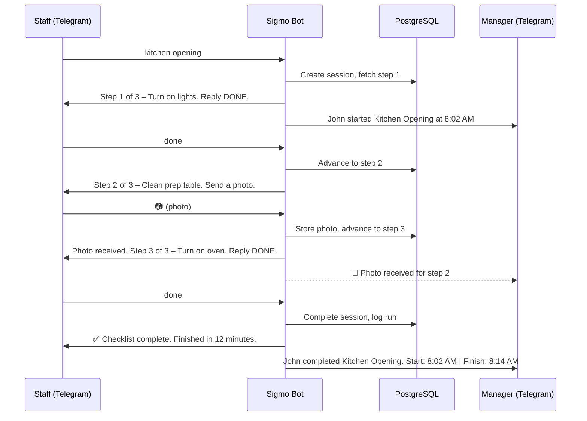
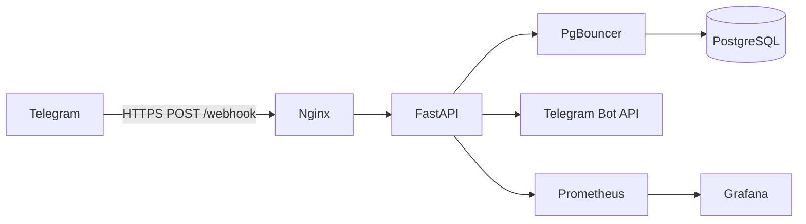
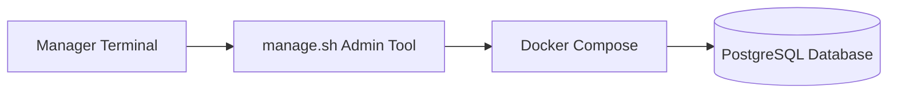

# Sigmo – Telegram Checklist Bot

Sigmo is a Telegram-based operational checklist bot for restaurant staff. It guides employees through predefined step-by-step procedures and gives managers real-time visibility into checklist progress.

## How It Works



## Architecture



## Supported Checklists

| Command           | Checklist ID  |
| ----------------- | ------------- |
| `kitchen opening` | KITCHEN_OPEN  |
| `kitchen closing` | KITCHEN_CLOSE |
| `dining opening`  | DINING_OPEN   |
| `dining closing`  | DINING_CLOSE  |

## Quick Start

```bash
# Clone and configure
cp .env.example .env
# Fill in TELEGRAM_BOT_TOKEN and POSTGRES_PASSWORD

# Run with Docker
docker compose up -d --build

# Apply migrations
docker compose exec fastapi alembic upgrade head

# Register Telegram webhook
curl -X POST "https://api.telegram.org/bot<TOKEN>/setWebhook" \
     -d "url=https://yourdomain.com/webhook"

# Verify
curl https://yourdomain.com/health
```

## Running Tests

```bash
pip install -r requirements.txt
pytest tests/ -v
```

## Project Structure

```
sigmo/
├── app/
│   ├── main.py              # FastAPI app: /webhook, /health, /metrics
│   ├── bot/                  # Command parser, handlers, notifier
│   ├── core/                 # Config, database, scheduler
│   ├── models/               # 6 SQLAlchemy ORM models
│   ├── schemas/              # Pydantic models for Telegram payloads
│   ├── services/             # Checklist engine, session CRUD, reports
│   └── metrics/              # Prometheus counters & histograms
├── migrations/               # Alembic migrations
├── tests/                    # 29 tests (pytest + aiosqlite)
├── docker/                   # Dockerfile, nginx.conf, pgbouncer.ini
├── docker-compose.yml        # Dev environment
├── docker-compose.prod.yml   # Production environment
└── DEPLOYMENT.md             # Full deployment guide
```

## Documentation

- [Deployment Guide](DEPLOYMENT.md) – Step-by-step server setup and deployment instructions

# Sigmo – Admin Management Tool

Sigmo includes a simple terminal-based management tool that allows managers or administrators to manage the system **without writing SQL commands**.

The tool provides a guided interface for:

- Adding staff members
- Adding managers
- Viewing staff
- Viewing managers
- Deleting staff
- Deleting restaurants
- Editing reminder times
- Adding checklist steps

This tool safely executes the necessary database commands inside the Docker environment.

---

# Architecture



The flow works like this:

1. The manager runs `manage.sh`
2. The script prompts for inputs
3. The script executes database commands using Docker
4. PostgreSQL stores the changes

---

# Setup

These steps only need to be done **once** after deploying Sigmo.

SSH into your server:

```bash
ssh user@your-vps-ip
```

Navigate to the Sigmo directory:

```bash
cd sigmo
```

Create the admin script:

```bash
nano manage.sh
```

Paste the `manage.sh` script contents provided in the deployment guide.

Save and exit:

```
CTRL + X
Y
ENTER
```

Make the script executable:

```bash
chmod +x manage.sh
```

The tool is now ready to use.

---

# Running the Admin Tool

Start the tool:

```bash
./manage.sh
```

You will see the main menu:

```
================================
        SIGMO ADMIN TOOL
================================

1) Add Staff
2) Add Manager
3) View Staff
4) View Managers
5) Delete Staff
6) Delete Restaurant
7) Edit Reminder Times
8) Add Checklist Step
9) Exit
```

Select the number corresponding to the action you want.

---

# Example Workflow

### Adding a Staff Member

```
Select option: 1
Staff chat_id: 123456789
Staff name: John
Restaurant ID: R001
```

The tool will confirm the action before applying the change.

---

### Viewing Staff

```
Select option: 3
```

The system will display all registered staff members.

---

### Editing Reminder Times

```
Select option: 7
Restaurant ID: R001
Opening reminder time: 10:00
Closing reminder time: 22:00
```

Reminder times must be in **24-hour format (HH:MM)**.

---

# Important Notes

### 1. Sigmo must be running

The Docker services must be active before using the tool.

If necessary, start them with:

```bash
docker compose -f docker-compose.prod.yml up -d
```

---

### 2. Telegram Chat IDs

To find a Telegram chat ID, send a message to:

https://t.me/userinfobot

The bot will return your Telegram ID.

---

### 3. Restaurant IDs

Restaurant IDs are usually short codes like:

```
R001
R002
R003
```

Use the correct restaurant ID when adding staff or managers.

---

# Safety Features

The admin tool includes several protections to prevent accidental mistakes:

- Input validation
- Confirmation prompts before deleting data
- Safe SQL execution inside Docker
- Color-coded messages for warnings and success states
- Menu loop to prevent accidental exits

---

# Recommended Usage

This tool is intended for:

- Restaurant managers
- System administrators
- Non-technical users managing staff

It allows safe administration of Sigmo without requiring knowledge of SQL or Docker.

---

## License

Proprietary – All rights reserved.
